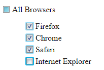

# Checkbox with undefined state
Just a checkbox which can have unefined state, eg if not all underlying checkboxes are selected. Styled with image sprite. Keyboard/mouse/touch interactable.

## Example 

//Actually it works in all major browsers

Circa 2012
